

 <h1 align="center">Project on Robotics - Design model and PID controller for balanced Quadcopter using Optical Flow algorithm</h1>

# Introduction
This project does the following tasks:
- Build hardware for Quadcopter model with dimensions 198x235x85 mm.
- Design a PID controller to stabilize the position of the Quadcopter chassis.
- Use Optical Flow image processing to keep Quadcopter balance.
- Conduct actual operation to check the response of the controller.

# Design Quadcopter model
Quadcopter is a UAV with 4 propeller engines, which generate lift for the aircraft to take off. The direction of the quadcopter propeller along with the rotation and speed are factors that determine the aircraft's ability to fly and maneuver.

Quadcopter is a robot with 6 degrees of freedom. Therefore, in addition to translational motions in the x, y and z directions, it also moves in the roll, pitch and yaw angles.

  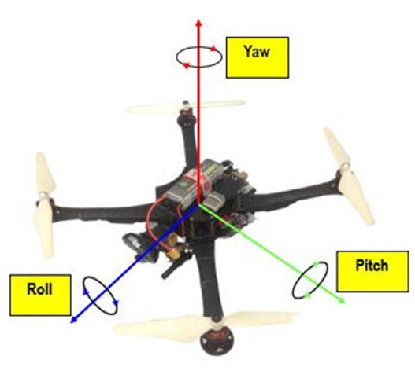 
  <i>Movement structure of Quadcopter</i>

The model of the Quadcopter in practice after construction is as follows:

  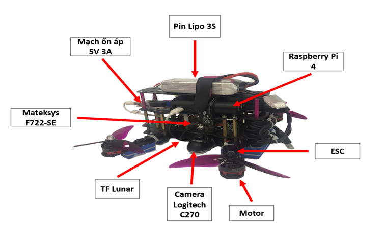 
  <i>Quadcopter hardware overview</i>

In this project, we use Camera Logitech C270 to apply Optical Flow to calculate drift from the Center of Frame and TF-Lunar 1D Lidar to calculate height of the Quadcopter. After that, we use that two-signal to control Quadcopter through two PID-controller. The protocol we use to control Quadcopter is YAMSPy (Yet Another Multiwii protocol).

# Optical Flow algorithm
The image processing algorithm used in the project is presented as the flowchart below:

  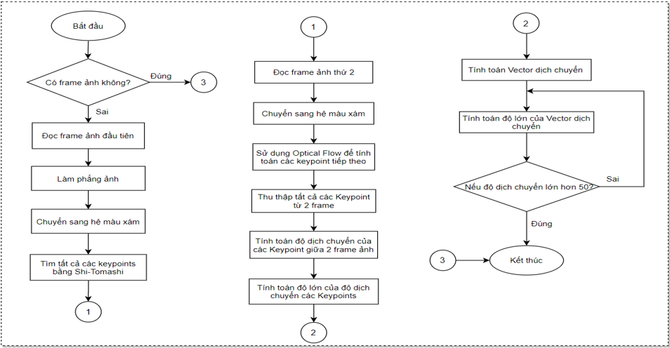 
  <i>Flowchart of image processing algorithm</i>

The above diagram shows the whole process of finding the displacement vector to generate the input value for balancing. First, the camera will read the first image frame, then flatten the image from the parameters after the camera Calibration because the image retrieved from the camera will be curved so the displacement vector will be incorrect. Then convert the image frame to grayscale. Because after flattening the image, the edge of the image will appear as a cut angle, making the Harris Corner algorithm recognize it as a keypoint, which will cause errors in the vector calculation. That's why we have to cut the center part. Then, using Harris Corner algorithm to find keypoints in the image frames. Then use Optical flow algorithm to calculate the displacement between frames and get the corresponding Displacement Vector value.

  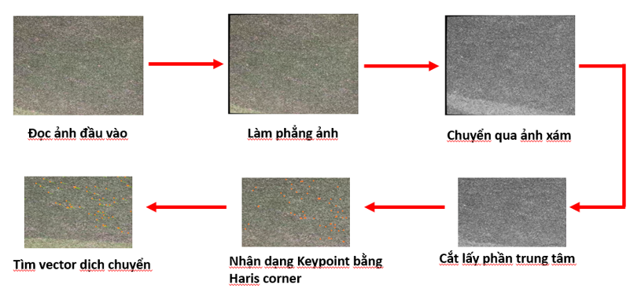 
  <i>Displacement Vector Calculation Process</i>

However, there are still cases that cause the process to be terminated. That is when the Quadcopter moves too far from the original point (50cm), the image processing algorithm will end. Then, Quadcopter will update the Keypoints and start the image processing again.

# Build a PID controller
The first controller is the altitude controller. In order for the Quadcopter to maintain altitude, the control signal value is the Throttle control pulse output value. In order for the Quadcopter to maintain the desired altitude, the PID controller value needs to be calibrated so that the Throttle value is calculated around the equilibrium working point.

  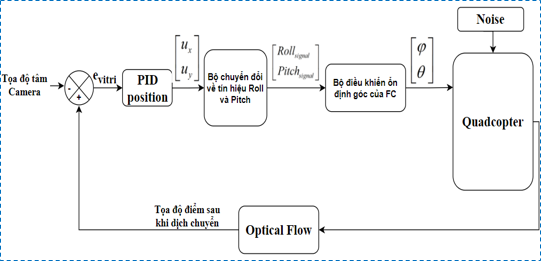 
  <i>Block diagram of position PID controller</i>

  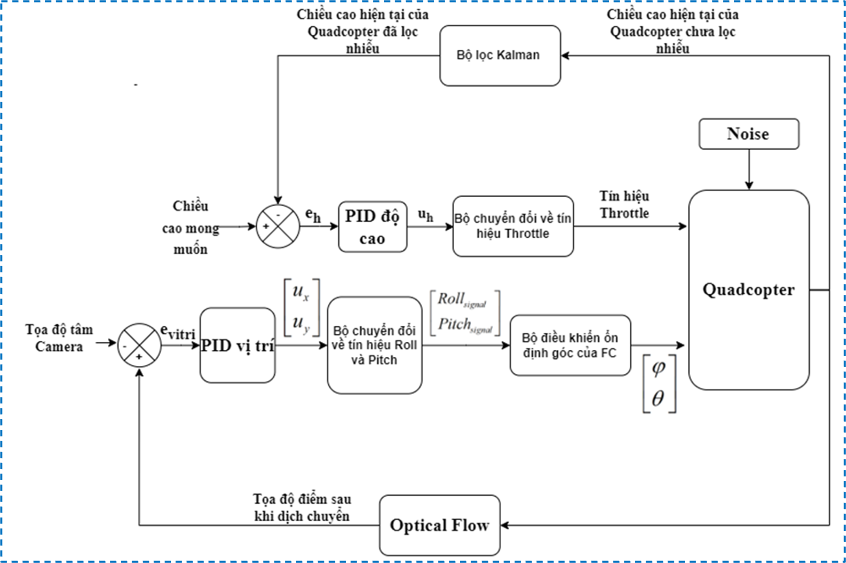 
  <i>General controller of the system</i>

# Results and reviews

- **Evaluation of image processing algorithms:**
Because the camera is always curved, the value of the image processing algorithm is often wrong. Therefore, the process of camera calibration plays a very important role.

  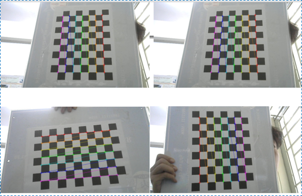 
  <i>Camera calibration process</i>

- **Optical Flow algorithm results:**
Result of applying PLK (Pyramid Lucas – Kanade) algorithm when there are few features (left figure).
Result of applying PLK (Pyramid Lucas – Kanade) algorithm when there are many features (right figure).

  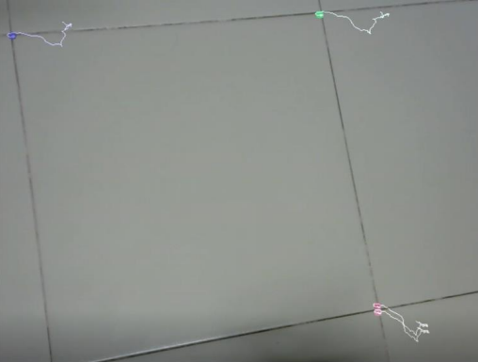
  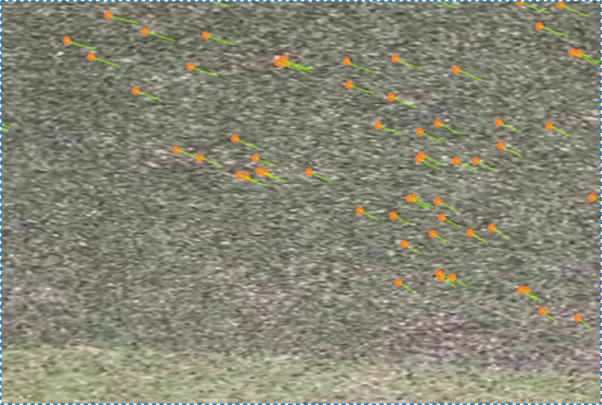

- **Evaluation of the PID controller:**
The PID controller applies to the Drone model to control altitude and position hold.

  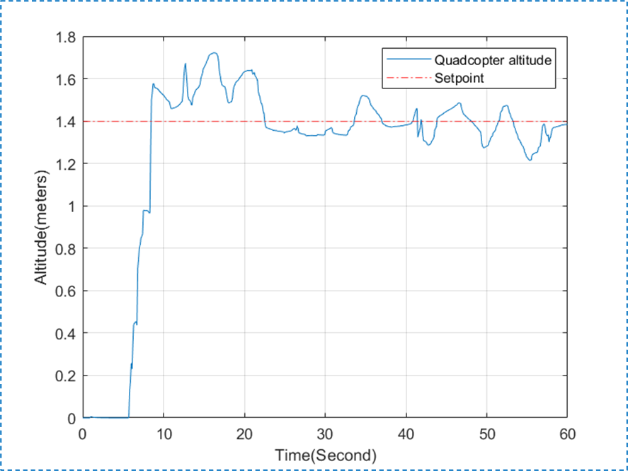 
  <i>Result of PID controller holding altitude</i>

  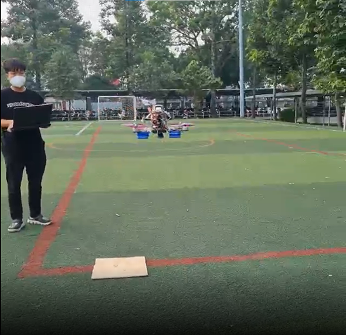 
  <i>Realistic results quadcopter keeps altitude and position</i>

# Video
https://youtu.be/sdybXYhyMzA
